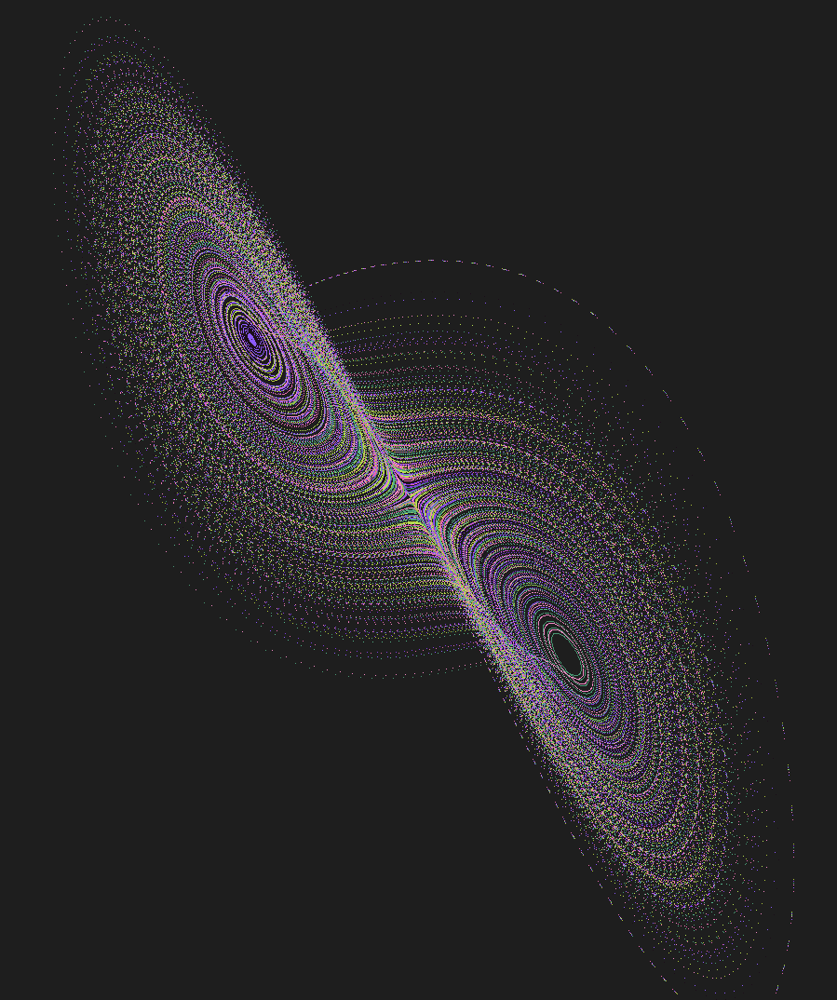

# Lorenz attractor visulization in C/SDL
The [Lorenz Attractor](https://en.wikipedia.org/wiki/Lorenz_system) is a set of differential
equations that when input with slightly different initial conditions, start to diverge paths 
in very unpredictable ways.



# Building
copy SDL2 lib and include folders in project directory
```
mkdir build
cmake -B build -S src
```
edit in the build/CMakeCache.txt
```c
//The directory containing a CMake configuration file for SDL2.
SDL2_DIR:PATH=PATH-TO-SDL-FOLDER
```
then run:
```
cd build
cmake --build .
Debug\lorenz.exe
```